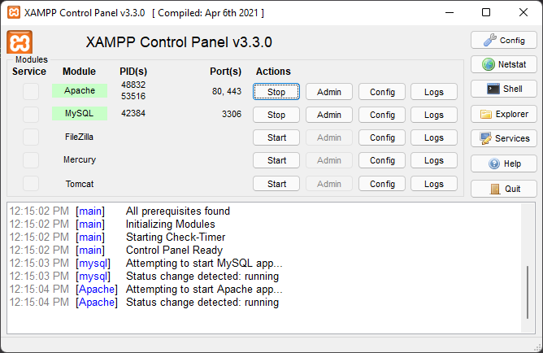

# PETS.CO - Online Pet Store

This is a online pet store demo website.

## How to use

1. Download [XAMPP](https://www.apachefriends.org/download.html).
2. Locate the xampp folder in your machine.
3. Navigate to htdocs inside the folder.
4. Clone this repository into the folder.
5. Run xampp.

6. Go to phpmyadmin and create a database with petsco as its name.
7. Import data from [petsco.sql](petsco.sql).
8. Enjoy!

## Sample Screenshots
### Main Menu

### Search Catalogue

### Item Page

### Cart & Previous Orders

### Checkout

### Admin Panel

## References

1. [Walking Dog](https://codepen.io/davidkpiano/pen/BGxgLa)
2. [Dog and Bone](https://codepen.io/chrisgannon/pen/OMomWJ)
3. [Bounce](https://codepen.io/aepicos/pen/RZwJYe)